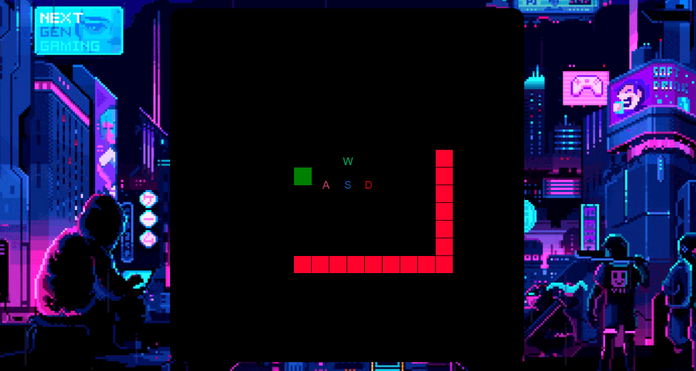

# 👨‍💻 LINK PARA ACESSAR A PAGINA WEB 👇

https://cezardev07.github.io/jogo_da_cobrinha/

 

 

# <h2> Esse Projeto foi criado para fins didatico com a intenção em estudar a estrutura condicional Switch Case no JS👨‍💻</h2>

 
<h2>⚙️ Tecnologias usadas nesse projeto ⚙️<h2>
<ul>
    <li>
Html5
</li>
    <li>
Css3
</li>
    <li>
JavaScript
</li>
</ul>

<h2>🔗 Para jogar o gamer basta pressionar as teclas W A S D ⚔️</h2> 

<ol>
    <li>
W _ top ⬆️
</li>
    <li>
A _ left ⬅️
</li>
    <li>
S _ bottom ⬇️
</li>
    <li>
D _ right ➡️
</li>
</ol>

